#  Last-Mile Delivery Analytics & Delay Root Cause Analysis


> An end-to-end **e-commerce delivery analytics** project analyzing 5,200 delivery records across 15 Indian cities to uncover delay patterns, SLA breaches, vendor performance, and root causes — built using **Python**, **SQL**, **Excel**, and **Power BI**.

---

## Table of Contents

- [Project Overview](#project-overview)
- [Tech Stack](#tech-stack)
- [Project Structure](#project-structure)
- [Dataset Overview](#dataset-overview)
- [Python — EDA](#python--exploratory-data-analysis)
- [SQL Analysis Performed](#sql-analysis-performed)
- [Power BI Dashboard](#power-bi-dashboard)
- [Key Business Insights](#key-business-insights)
- [Screenshots](#screenshots)
- [Skills Demonstrated](#skills-demonstrated)
- [Disclaimer](#disclaimer)
- [Author](#author)

---

##  Project Overview

The project focuses on analysing:

-  Delivery delay trends & SLA breach patterns
-  City & zone-wise operational performance
-  Warehouse efficiency & throughput analysis
-  Delivery agent productivity & outlier detection
-  Root cause analysis of delivery failures
-  Seasonal impact — Festive (Oct–Nov) & Monsoon (Jun–Sep) seasons
-  COD vs Prepaid payment mode impact on delays

The dashboard helps track operational KPIs and provides actionable business insights for improving last-mile delivery efficiency.

---

##  Tech Stack

| Tool | Purpose |
|---|---|
| **Python (Pandas)** | Exploratory Data Analysis |
| **Jupyter Notebook** | EDA & visualisation |
| **SQL** | Data extraction & business analysis |
| **Excel** | Data cleaning & preprocessing |
| **Power BI** | Interactive dashboards & visualisation |
| **Git & GitHub** | Version control |

---

##  Project Structure

```
Last_Mile_Delivery_Analytics/
│
├── Dataset/
│   ├── Last_Mile_Delivery_Dataset.csv          # Raw dataset (5,200 records)
│   └── Last_Mile_Delivery_Dataset_1.pdf        # Dataset documentation
│
├── Excel/
│   ├── Raw_Data.xlsx                           # Original data in Excel format
│   ├── Cleaned_Data.csv                        # Cleaned & processed data
│   ├── Cleaned_Data.xlsx                       # Cleaned data in Excel format
│   └── Excel_Dashboard.xlsx                    # Excel dashboard with charts
│
├── Python/
│   └── eda.ipynb                               # Exploratory Data Analysis notebook
│
├── SQL/
│   ├── Monthly Orders.txt                      # Monthly order trend queries
│   ├── city_analysis.sql.txt                   # City-wise delay analysis
│   ├── kpi_analysis.sql.txt                    # KPI summary queries
│   ├── root_cause_analysis.sql.txt             # Root cause breakdown queries
│   ├── seasonal_analysis.sql.txt               # Festive & monsoon analysis
│   └── vendor_analysis.sql.txt                 # Vendor performance queries
│
└── Screenshots/
    ├── Power bi/                               # Power BI dashboard screenshots
    ├── Python/                                 # EDA output screenshots
    └── SQL/                                    # SQL query result screenshots
```

---

##  Dataset Overview

| Metric | Value |
|---|---|
| Total Orders | 5,200 |
| Date Range | Jan 2024 – Dec 2024 |
| Cities | 15 Indian Cities |
| Delivery Agents | 150 |
| Vendors | 8 |
| Product Categories | 8 |
| Total Order Value | ₹3.88 Crore |
| **Delayed Orders** | **2,236 (43.0%)** |
| **SLA Breached** | **1,459 (28.1%)** |
| Avg Delay (when delayed) | 3.9 days |

###  Key Columns

| Column | Description |
|---|---|
| `Order_ID` | Unique order identifier |
| `Order_Date` | Date & time of order placement |
| `Promised_Delivery_Date` | Delivery date promised to customer |
| `Actual_Delivery_Date` | Actual delivery date |
| `City` | Delivery destination (15 cities) |
| `Zone` | North / South / East / West / Central |
| `Vendor` | Logistics partner (Delhivery, BlueDart, Ekart, etc.) |
| `Product_Category` | Electronics, Fashion, Groceries, etc. |
| `Order_Value_INR` | Order value in ₹ |
| `Payment_Mode` | Prepaid or COD |
| `Delay_Days` | Number of days delayed (0 = on time) |
| `Is_Delayed` | Y / N |
| `Delay_Reason` | Root cause of delay |
| `SLA_Breached` | Y / N (delay > 2 days) |
| `Is_Festive_Season` | Y if Oct–Nov |
| `Is_Monsoon_Season` | Y if Jun–Sep |

---

##  Python — Exploratory Data Analysis

EDA performed in `Python/eda.ipynb` covering:

- Dataset shape & preview
- Missing values detection
- City-wise order distribution
- Vendor performance breakdown
- Delay reason frequency analysis

### Screenshots

| Dataset Preview | Missing Values | Dataset Shape |
|---|---|---|
| 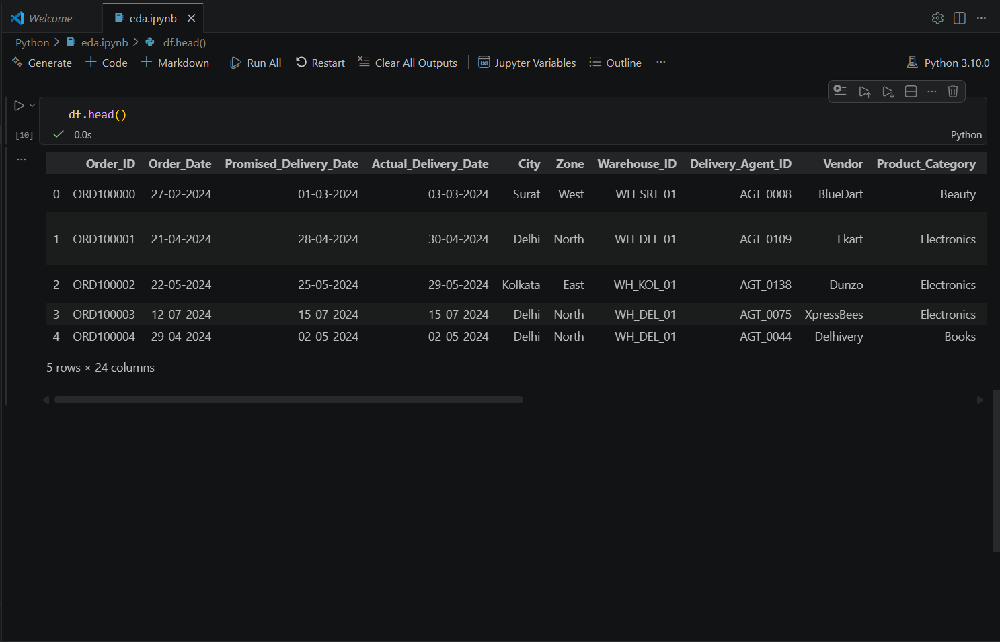 |
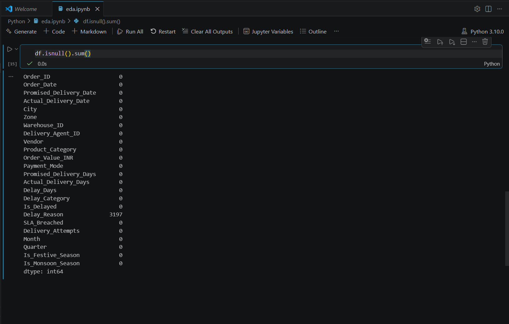 |
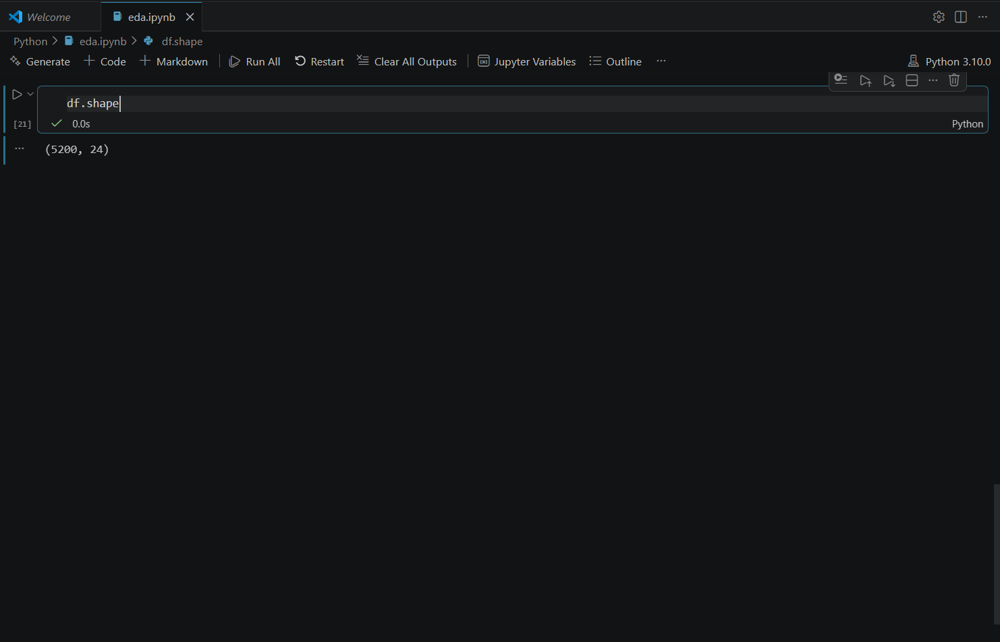 |

| Columns List | City Orders Table | Vendor Orders Table |
|---|---|---|
| 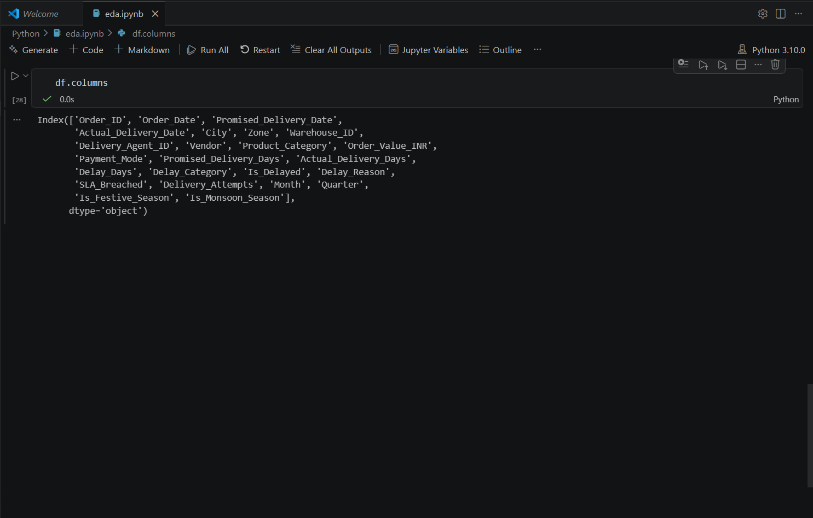 |
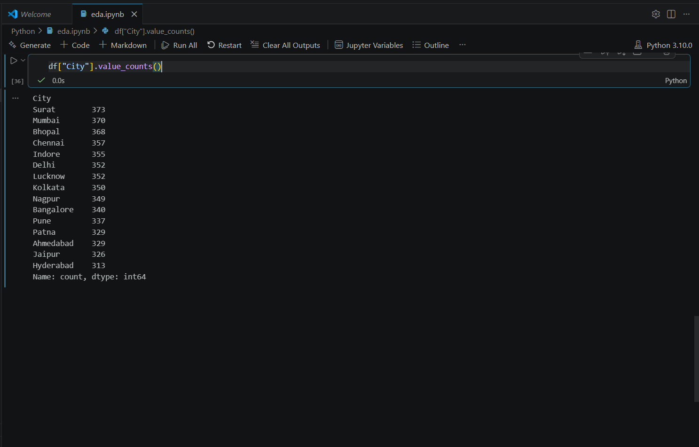 |
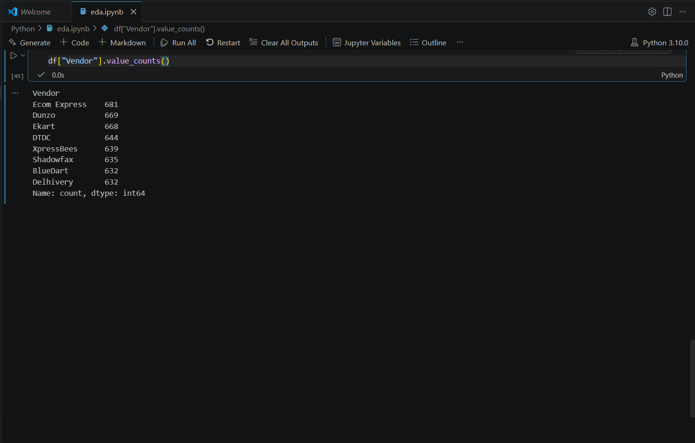 |

| Delay Reasons Table |
|---|
| 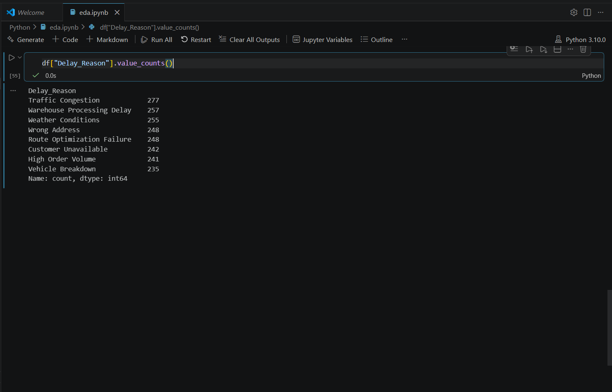 |

---

## 🗄️ SQL Analysis Performed

10 business questions answered using SQL:

| # | Analysis | SQL Concepts Used |
|---|---|---|
| 1 | Cities with highest delay rate — ranked | `GROUP BY`, `RANK()` |
| 2 | Warehouse with max SLA breaches per month | Window Functions, CTE |
| 3 | Top 10 agents by delay rate (min 50 orders) | `HAVING`, `DENSE_RANK()` |
| 4 | Delay rate: Festive vs Non-Festive season | `CASE WHEN`, `GROUP BY` |
| 5 | Best on-time vendor % by zone | Subquery, `PARTITION BY` |
| 6 | Month-over-month SLA breach trend | `LAG()`, Window Functions |
| 7 | COD vs Prepaid delay rate comparison | Conditional Aggregation |
| 8 | Product categories with highest avg delay | `AVG()`, `ORDER BY` |
| 9 | Agent outliers vs city average delay | CTE + Self Join |
| 10 | Root cause → revenue loss analysis | `JOIN`, `SUM`, `GROUP BY` |

### Screenshots

| KPI Summary | City-wise Orders | City Avg Delay |
|---|---|---|
| 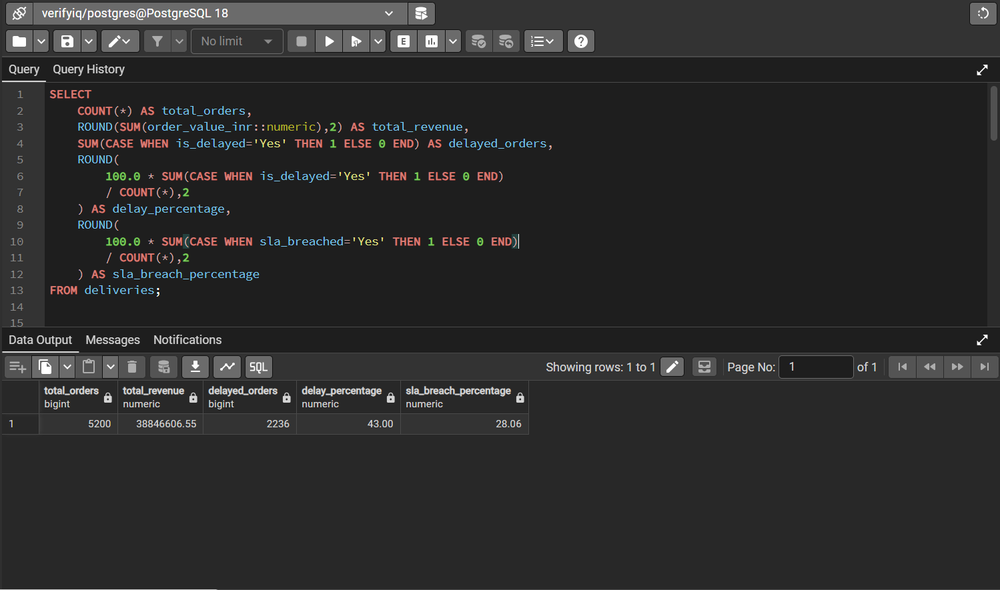 |
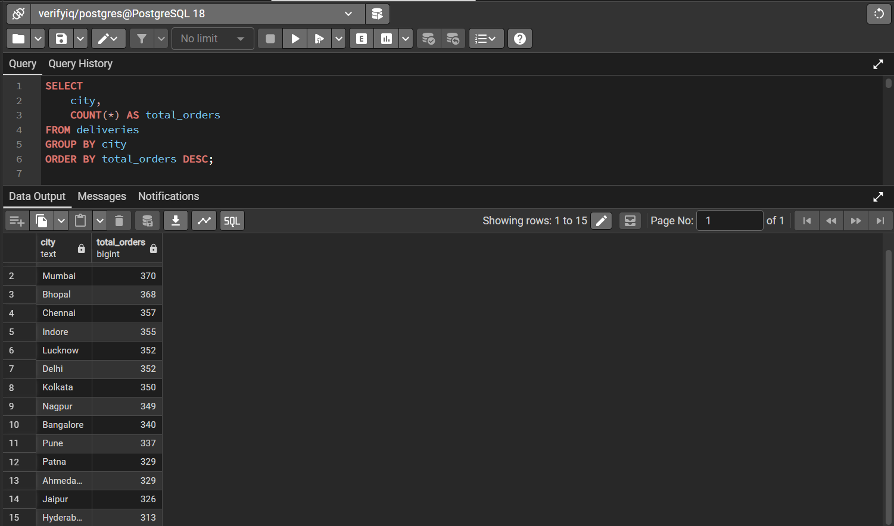 |
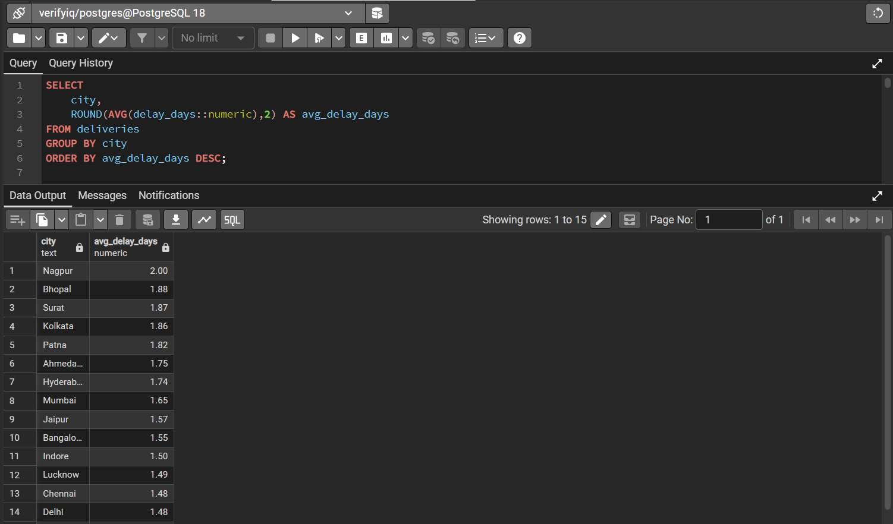 |

| Vendor Performance | Delay Root Causes | Revenue by Category |
|---|---|---|
| 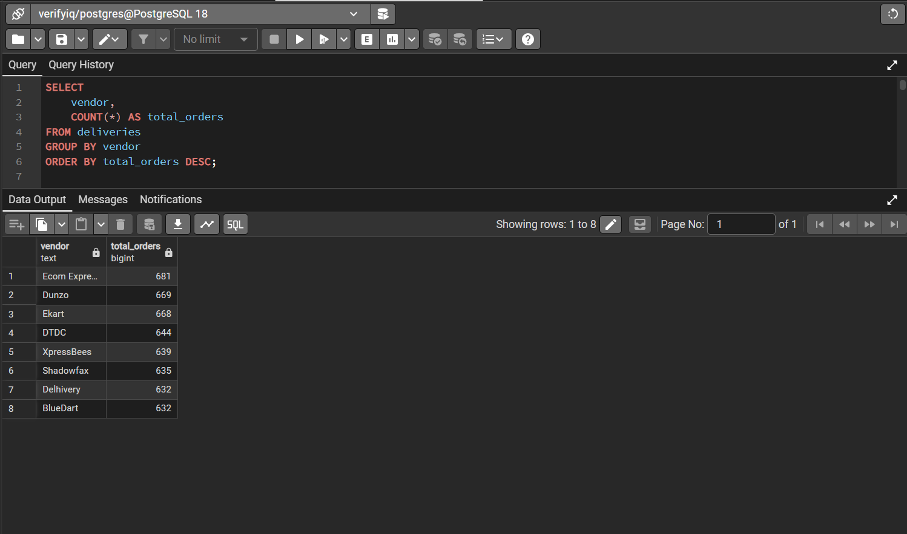 |
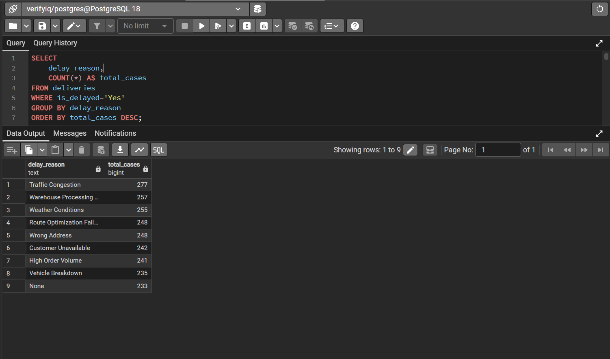 |
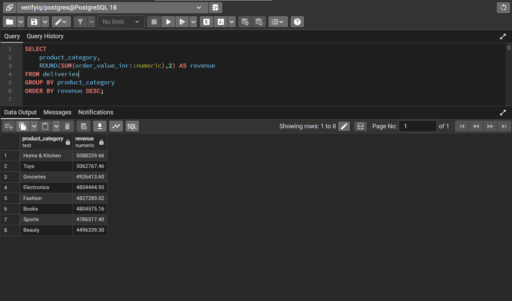 |

---

## 📈 Power BI Dashboard

6-page interactive dashboard built in Power BI that enables Operations and Supply Chain teams to monitor KPIs in real time, drill down by city or vendor, and identify delivery bottlenecks at a glance.

| Page | Dashboard Name | Key Visuals |
|---|---|---|
| 1 | **Executive Overview** | KPI Cards, Delay Trend Line, City Map |
| 2 | **City & Zone Analysis** | Filled Map, Bar Chart by Zone, Heat Map |
| 3 | **Warehouse Performance** | Bar Chart, Matrix Table, Scatter Plot |
| 4 | **Agent Performance** | Top/Bottom 10 Table, Gauge Chart |
| 5 | **Root Cause Analysis** | Donut Chart, Pareto Chart, Treemap |
| 6 | **Seasonal Trends** | Line Chart, Clustered Bar, Waterfall |

### Screenshot


---

##  Key Business Insights

- **43% of orders** were delayed — highest delays found in specific cities and during festive season (Oct–Nov)
- **SLA breach rate of 28.1%** with an average delay of 3.9 days for delayed orders
- **COD orders** showed consistently higher delay rates compared to Prepaid orders
- **Monsoon season (Jun–Sep)** had a notable impact on delivery timelines due to weather-related disruptions
- **Vendor performance** varied significantly across zones, with clear top and bottom performers
- Root cause analysis revealed **Wrong Address** and **Vehicle Breakdown** as the leading delay drivers

---

## 🎯 Skills Demonstrated

- Python EDA (Pandas, Jupyter Notebook)
- SQL Query Writing & Optimisation
- Window Functions, CTEs, Aggregations
- Power BI Dashboarding & DAX
- Excel Data Cleaning & Preprocessing
- Root Cause & Delay Analysis
- Business KPI Monitoring & Reporting
- Operational & Supply Chain Analytics
- Git & GitHub Version Control

---

## ⚠️ Disclaimer

> This dataset is **synthetically generated** for portfolio/learning purposes using realistic Indian e-commerce delivery patterns. All Order IDs and Agent IDs are fictional.

---

## 👤 Author

Made with ❤️ for data analytics portfolio showcase.

Feel free to ⭐ this repo if you found it helpful!
